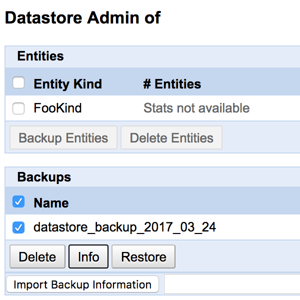
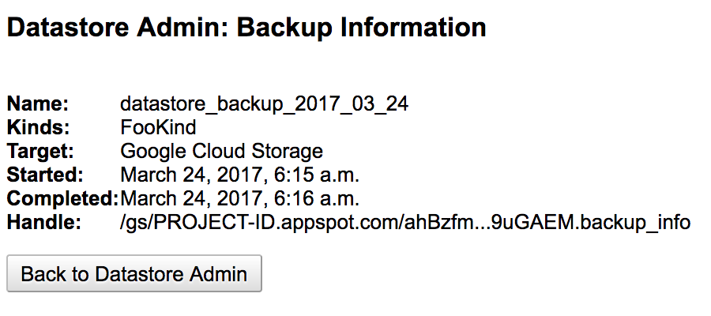

=====
tirds
=====

``tirds`` is a command-line tool to backup and restore Google Cloud Datastore Entities via local.

``tirds`` stands for `Totte IRete DaSu(DataStore) <https://goo.gl/5xYMA3>`_.

You can back up Google Cloud Datastore entities, and restore them. Backups are saved to Google Cloud Storage. For details, see `Backing Up and Restoring <https://cloud.google.com/appengine/docs/standard/python/console/datastore-backing-up-restoring>`_.

But if you move a backup to another bucket, you will not be able to restore it. Because the ``backup_info`` file that is metadata of the backup includes the bucket name.

``tirds`` downloads a backup contains ``backup_info`` and blob files from the specified bucket, and uploads it to another bucket after replacing the bucket name in the ``backup_info``.

Installation
============

To install, use ``pip``.

.. code-block:: bash

    $ pip install tirds

Usage
=====

.. code-block:: bash

    $ tirds -h

---------------
Download backup
---------------

Download a backup from Google Cloud Storage.

.. code-block:: bash

    $ tirds download --out OUTDIR --key-file KEYFILE handle

You can get ``handle`` from datastore admin.

``KEYFILE`` is a path to the private key file for Service Account.

-------------
Upload backup
-------------

Upload a backup to Google Cloud Storage after replacing the bucket name.

.. code-block:: bash

    $ tirds upload --key-file KEYFILE srcdir bucket

``srcdir`` is a path to the backup.

``bucket`` is a bucket name that is the upload destination and to be replaced with original bucket name.
